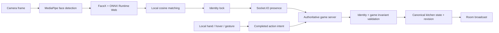
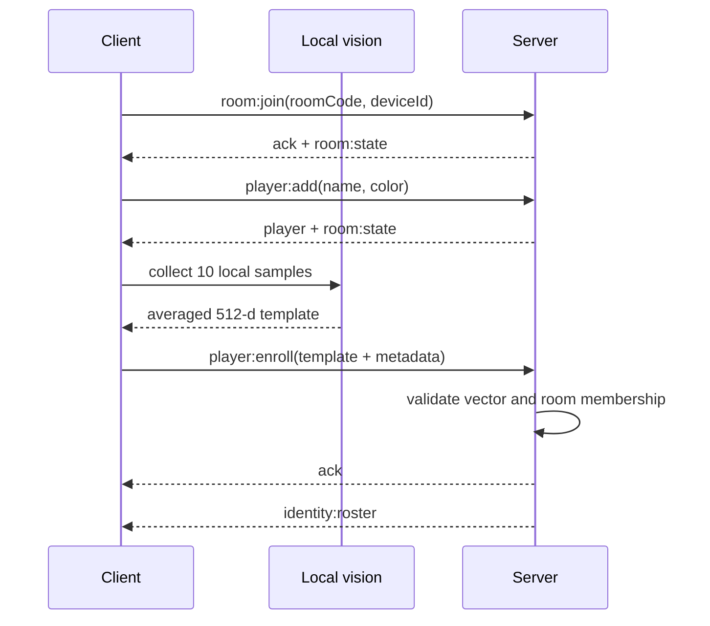
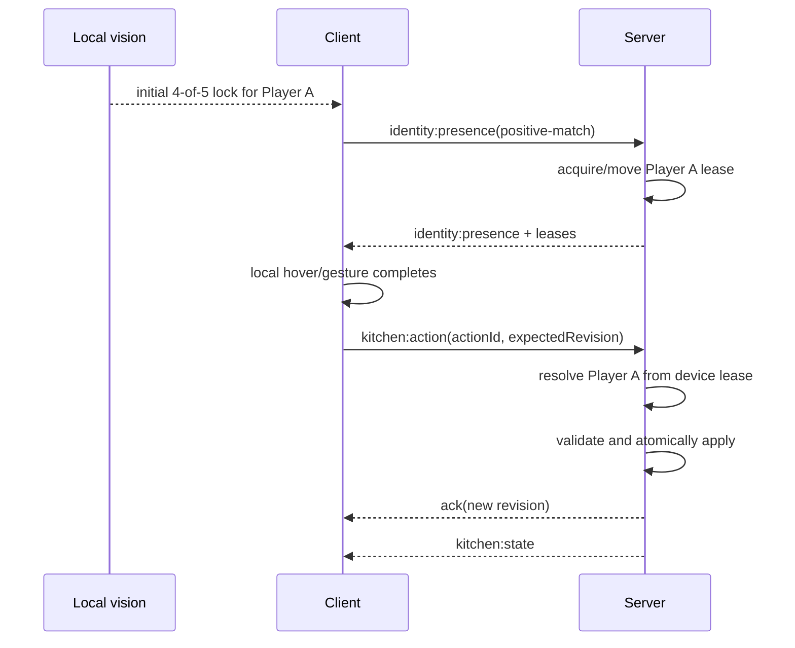

# MovingKitchen 多人同步与 Roaming Identity 接入契约

> 状态：Implementation Reference / Integration Contract  
> 适用对象：MovingKitchen 前端、后端、Computer Vision、QA 与部署工程师  
> 参考实现：[Cactus-Std/multiplayer-identification](https://github.com/Cactus-Std/multiplayer-identification)  
> 与玩法规则的关系：玩法以 [`SPEC.md`](./SPEC.md) 为准；本文负责 multiplayer transport、玩家添加、人脸 enrollment、identity lock、presence 与 server authorization。

## 1. 已验证能力与接入结论

`multiplayer-identification` prototype 已端到端验证：

- 通过四位 room code 创建、加入和退出临时房间；
- 2–4 台浏览器通过 Socket.IO 接收 authoritative room/game state；
- 添加最多四名 name/color 唯一的玩家；
- 在 browser 本地完成 face detection、alignment 和 embedding inference；
- 只把 512-dimensional normalized face embedding 发给 server，不上传 camera frame；
- 每台电脑使用房间内的 enrolled embeddings 本地识别玩家；
- 用 rolling-window stabilization 建立 sticky identity lock；
- 通过 presence heartbeat 让 server 判断某台 device 当前代表哪名 player；
- server 在接受游戏动作前校验 socket、room、device、presence 和 player identity；
- reconnect 后重新加入 room，并由 server snapshot 恢复 canonical state。

MovingKitchen 不应在运行时依赖 prototype 的线上房间。推荐做法是：clone 参考项目，迁入经过验证的 shared contracts、vision provider、stabilizer、Socket.IO lifecycle 和 server authorization pattern；然后为 MovingKitchen 新建独立的 realtime backend 与 frontend deployment。

## 2. 不可破坏的 architecture boundaries



必须保持以下边界：

1. Camera frame、face crop、hand coordinates 和逐帧 gesture data 留在当前 browser。
2. Server 只接收 face template、低频 presence 和已经完成的 game action intent。
3. Client 不直接修改 canonical kitchen state；它只提出 command。
4. Server 从 device presence 推导 acting player，`kitchen:action` 不接受 client 自报 `playerId`。
5. 玩家携带物绑定 `playerId`，不能绑定 laptop、socket 或 scene。
6. Shared event/type definitions 只有一份，前后端从同一个 package import。
7. Vision provider 与 React UI 解耦；换模型不能要求重写游戏页面。
8. 每台控制用 laptop 在 join 时绑定一个 `StationId`；server 校验 action 的 station 与该 device binding 一致。重复 station 只能用于显式 spectator/debug mode。

## 3. 参考项目中应迁移的模块

Clone：

```bash
git clone https://github.com/Cactus-Std/multiplayer-identification.git
```

正式迁移前，应先把 reference repo 当前通过测试的工作树合并并打 tag，随后在 MovingKitchen 的 ADR/lockfile 中记录 exact commit SHA。不要长期依赖 default branch 的浮动状态，否则模型 preprocessing、event schema 与文档可能在不同时间被复制。

建议优先参考或迁移：

| Reference path                                | MovingKitchen 用途                                     |
| --------------------------------------------- | ------------------------------------------------------ |
| `packages/shared/src/types.ts`                | Room、Player、DevicePresence baseline                  |
| `packages/shared/src/events.ts`               | Typed Socket.IO event pattern                          |
| `apps/server/src/roomManager.ts`              | Authoritative room state、validation、snapshot pattern |
| `apps/server/src/socketHandlers.ts`           | Socket membership 与 payload/device binding            |
| `apps/client/src/networking/socket.ts`        | 单一 client transport gateway、reconnect/rejoin        |
| `apps/client/src/vision/`                     | Detection、alignment、embedding、matching、stabilizer  |
| `apps/client/src/hooks/useFaceRecognition.ts` | Inference lifecycle 与 candidate ref pattern           |
| `apps/client/src/hooks/usePresenceSync.ts`    | Identity change + heartbeat cadence                    |
| `TECHNICAL_HANDOFF.zh-CN.md`                  | 模型、WASM、LAN、Render 与历史问题记录                 |
| `THIRD_PARTY_NOTICES.md`                      | Model/runtime provenance、license 与 hashes            |

不要只复制一个 React component。最小可用闭环至少包含 shared contracts、model assets、WASM asset copy、vision provider、presence、server validation 和 tests。

## 4. MovingKitchen 推荐 domain model

以下 TypeScript 是接口基线。实现时放在 shared workspace，例如 `packages/shared/src/`。

```ts
export type RoomCode = string;
export type DeviceId = string;
export type PlayerId = string;
export type ItemId = string;
export type ActionId = string;
export type Revision = number;

export type PlayerColor = "red" | "blue" | "green" | "yellow";
export type StationId = "storage-sink" | "board-1" | "board-2" | "oven-pass";
export type IdentityEvidence =
  "positive-match" | "lock-heartbeat" | "manual-debug" | "cleared";

export interface FaceTemplateUpload {
  vector: number[]; // exactly 512 finite, L2-normalized values
  modelId: "facex-tiny-mobilefacenet";
  modelVersion: string;
  preprocessingVersion: "rgb-112-nchw-v1";
}

export interface FaceTemplate extends FaceTemplateUpload {
  enrolledAt: number; // server timestamp
}

export interface Player {
  id: PlayerId;
  name: string;
  color: PlayerColor;
  enrolled: boolean;
}

export interface IdentityCandidate {
  playerId: PlayerId;
  template: FaceTemplate;
}

export interface DevicePresence {
  deviceId: DeviceId;
  lockedPlayerId: PlayerId | null;
  confidence: number | null;
  evidence: IdentityEvidence;
  lastHeartbeatAt: number; // server timestamp
  lastPositiveMatchAt: number | null; // server timestamp
}

export interface PlayerControlLease {
  playerId: PlayerId;
  deviceId: DeviceId;
  acquiredAt: number;
  lastHeartbeatAt: number;
}

export type ItemKind =
  | "tomato"
  | "sausage"
  | "cheese"
  | "dough"
  | "knife"
  | "cloth"
  | "whisk"
  | "oven-mitt"
  | "pizza-cutter"
  | "pizza";

export type IngredientKind = "tomato" | "sausage" | "cheese" | "dough";
export type IngredientProcessState =
  "dirty" | "clean" | "raw" | "chopped" | "cooked" | "burnt";
export type ItemLocation =
  | "storage"
  | "carried"
  | "sink"
  | "board-1"
  | "board-2"
  | "oven"
  | "pass"
  | "discarded";

export interface IngredientState {
  id: ItemId;
  kind: IngredientKind;
  processState: IngredientProcessState;
  cleanliness: number; // 0..100
  cutProgress: number; // 0..100
  hygiene: number; // 0..100
  location: ItemLocation;
  heldBy: PlayerId | null;
}

export interface StationState {
  stationId: StationId;
  occupiedItemId: ItemId | null;
  dirty: boolean;
  contaminationCount: number;
}

export interface OvenState {
  ingredientItemIds: Partial<Record<IngredientKind, ItemId>>;
  pizzaItemId: ItemId | null;
  status: "idle" | "baking" | "ready" | "burnt";
  startedAt: number | null; // server timestamp
  cookProgress: number; // 0..100 derived from server time
}

export interface WasteState {
  total: number;
  tomato: number;
  sausage: number;
  cheese: number;
  dough: number;
}

export interface KitchenState {
  revision: Revision;
  status: "lobby" | "playing" | "finished";
  remainingMs: number;
  playerCarry: Record<PlayerId, ItemId | null>;
  ingredients: Record<ItemId, IngredientState>;
  stations: Record<StationId, StationState>;
  waterRemaining: number;
  faucetOn: boolean;
  oven: OvenState;
  waste: WasteState;
  score: number;
}

export interface RoomState {
  code: RoomCode;
  hostDeviceId: DeviceId;
  players: Player[];
  connectedDeviceIds: DeviceId[];
  stationByDevice: Record<DeviceId, StationId>;
  presenceByDevice: Record<DeviceId, DevicePresence>;
  controlLeaseByPlayer: Record<PlayerId, PlayerControlLease | undefined>;
  kitchen: KitchenState;
  createdAt: number;
}
```

`IngredientState`、`StationState`、`OvenState` 和 `WasteState` 的字段以玩法 SPEC 为准。重要 invariant 是 `playerCarry[playerId]` 最多只有一个 `itemId`，并且 item 的 `heldBy/location` 必须与它一致。

### Public state 与 biometric roster

Prototype 为了简单，把 embedding 放在 `Player` 并随 room snapshot 广播。MovingKitchen 推荐让 public `Player` 不包含 vector，并在 transport 层拆分：

- `room:state` / `kitchen:state`：普通 canonical game state；
- `identity:roster`：只向已加入该 room 的 client 下发 `IdentityCandidate[]`；
- 日志、analytics、error reporting 和 replay 中禁止记录 template vector。

## 5. 玩家添加与 enrollment 方法论

### 5.1 添加玩家

Server 必须验证：

- room 仍在 lobby；
- name 去空格后长度为 1–24；
- name 在 room 内 case-insensitive unique；
- color 在 room 内 unique；
- player count 不超过 4；
- `playerId` 由 server 生成，client 不能指定。

### 5.2 Face enrollment

1. Browser 请求 `getUserMedia()`；正式部署使用 HTTPS，本地允许 `http://localhost`。
2. MediaPipe 检测恰好一张可用人脸。
3. Enrollment 要求 face width 约为 video width 的 20%，保持正面、单人、均匀光线。
4. 用 eye keypoints 将 face alignment 到 112 × 112 RGB crop。
5. FaceX Tiny / ONNX Runtime Web 输出 512-d embedding。
6. 收集 10 个有效 sample，逐维平均后再次 L2 normalize。
7. Client 发送最终 vector 与 model/preprocessing metadata；不发送图片或视频。
8. Server 验证 dimension、finite values、L2 norm、player membership 和 payload size 后保存。
9. Server 更新 identity roster，room 内其他 device 才能识别该 player。

Server validation：

```ts
function assertFaceTemplate(template: FaceTemplateUpload): void {
  if (template.vector.length !== 512) throw new Error("INVALID_DIMENSION");
  if (template.vector.some((value) => !Number.isFinite(value))) {
    throw new Error("INVALID_VECTOR");
  }
  const magnitude = Math.sqrt(
    template.vector.reduce((sum, value) => sum + value * value, 0),
  );
  if (magnitude < 0.99 || magnitude > 1.01) {
    throw new Error("NOT_L2_NORMALIZED");
  }
}

function acceptFaceTemplate(upload: FaceTemplateUpload): FaceTemplate {
  assertFaceTemplate(upload);
  return { ...upload, enrolledAt: Date.now() };
}
```

### 5.3 Recognition 与 sticky identity

当前经过游戏体验调整的 baseline：

- detection attempt：每 250 ms，约 4 Hz；
- detection confidence：0.5；
- gameplay 最小 face width：约 video width 的 8%；
- cosine match threshold：0.62；
- best 与 second-best margin：0.08；
- 初次 lock：5 个 prediction window 中同一 player 至少 4 次；
- 已 lock 后不因 null/missed detection 清除；
- identity switch：另一 enrolled player 连续 5 次明确匹配；
- 离开 room、显式 reset 或 recognition lifecycle teardown 时清除。

这些参数必须通过目标 camera、灯光、玩家人群测试校准，不能被视为通用 biometric threshold。

## 6. Presence、sticky lock 与 active-device lease

Sticky identity 提升游戏连续性，但会带来一个跨屏问题：玩家从 Laptop A 走到 Laptop B 后，A 仍可能保留旧 lock。如果两台机器都能以同一个 player 执行动作，会破坏“一人一件随身物品”的 invariant。

MovingKitchen 应使用 `PlayerControlLease`：

1. `positive-match` 可以创建或迁移 player 的 active-device lease。
2. `lock-heartbeat` 只能续期当前 device 已持有的 lease，不能从另一台 device 抢回 lease。
3. B 对 player 产生新的 `positive-match` 后，server 把 lease 从 A 原子迁移到 B。
4. A 可以继续显示 last locked player，但其 kitchen action 会因不是 lease owner 被拒绝。
5. `cleared`、leave、disconnect 或 lease expiry 释放对应 device 的 lease。
6. 所有时间以 server `Date.now()` 为准；client timestamp 只能作 telemetry，不能参与授权。

推荐 cadence：

```text
positive raw match       -> emit immediately, then throttle to at most 1/second
lock without fresh match -> heartbeat every 1 second
server presence expiry   -> 2–5 seconds, calibrated for network jitter
```

只在 identity change 时发送 `positive-match` 不够：玩家回到一台仍保留相同 sticky lock 的旧电脑时，lock 没有发生 change，但 control lease 仍需要迁移。因此 raw match 再次确认 locked player 时也要发送 throttled `positive-match`；没有 fresh raw match 时才发送 `lock-heartbeat`。`manual-debug` 只有在显式 debug configuration 下才能获取 lease。

## 7. Socket.IO v1 contract

所有 interface 应放在 shared package。每个 command 带 `protocolVersion`、`requestId`，写操作额外带 `actionId` 或同等 idempotency key。

```ts
export type ErrorCode =
  | "UNSUPPORTED_PROTOCOL"
  | "INVALID_REQUEST"
  | "ROOM_NOT_FOUND"
  | "ROOM_FULL"
  | "PLAYER_NOT_FOUND"
  | "PLAYER_NOT_ENROLLED"
  | "NOT_AUTHORIZED"
  | "PRESENCE_STALE"
  | "CONTROL_LEASE_MOVED"
  | "REVISION_CONFLICT"
  | "ITEM_NOT_AVAILABLE"
  | "HANDS_FULL"
  | "INVALID_ITEM_STATE"
  | "INVALID_STATION"
  | "ACTION_ALREADY_APPLIED"
  | "RATE_LIMITED"
  | "INTERNAL_ERROR";

export interface CommandMeta {
  protocolVersion: 1;
  requestId: string;
}

export interface CommandError {
  requestId: string | null;
  actionId?: ActionId;
  code: ErrorCode;
  message: string;
  retryable: boolean;
  canonicalRevision?: Revision;
}

export type CommandAck<T> =
  { ok: true; data: T } | { ok: false; error: CommandError };

export interface CreateRoomPayload extends CommandMeta {
  deviceId: DeviceId;
  stationId: StationId;
}

export interface JoinRoomPayload extends CommandMeta {
  roomCode: RoomCode;
  deviceId: DeviceId;
  stationId: StationId;
}

export interface LeaveRoomPayload extends CommandMeta {
  roomCode: RoomCode;
  deviceId: DeviceId;
}

export interface AddPlayerPayload extends CommandMeta {
  roomCode: RoomCode;
  name: string;
  color: PlayerColor;
}

export interface EnrollPlayerPayload extends CommandMeta {
  roomCode: RoomCode;
  playerId: PlayerId;
  template: FaceTemplateUpload;
}

export interface PresenceUpdatePayload extends CommandMeta {
  roomCode: RoomCode;
  deviceId: DeviceId;
  lockedPlayerId: PlayerId | null;
  confidence: number | null;
  evidence: IdentityEvidence;
  clientObservedAt: number; // telemetry only; never authorization time
}

export interface StartGamePayload extends CommandMeta {
  roomCode: RoomCode;
  deviceId: DeviceId;
}

export interface ResyncPayload extends CommandMeta {
  roomCode: RoomCode;
  deviceId: DeviceId;
  knownRevision: Revision | null;
}
```

Kitchen actions 使用 discriminated union：

```ts
export type KitchenAction =
  | { kind: "PICK_UP"; itemId: ItemId; stationId: StationId }
  | { kind: "PLACE"; itemId: ItemId; stationId: StationId }
  | { kind: "RETURN_TOOL"; itemId: ItemId; stationId: StationId }
  | { kind: "TOGGLE_FAUCET"; enabled: boolean }
  | { kind: "WASH_PROGRESS"; itemId: ItemId; cleanedSpotIds: string[] }
  | { kind: "CHOP_PROGRESS"; itemId: ItemId; delta: number }
  | { kind: "DISCARD"; itemId: ItemId; stationId: "board-1" | "board-2" }
  | { kind: "ADD_TO_OVEN"; itemId: ItemId }
  | { kind: "REMOVE_PIZZA"; itemId: ItemId }
  | { kind: "SLICE_PIZZA"; itemId: ItemId };

export interface KitchenActionPayload extends CommandMeta {
  actionId: ActionId;
  roomCode: RoomCode;
  deviceId: DeviceId;
  expectedRevision: Revision;
  action: KitchenAction;
  // Deliberately no playerId. Server resolves it from presence + lease.
}
```

Typed event maps：

```ts
export interface ClientToServerEvents {
  "room:create": (
    payload: CreateRoomPayload,
    ack: (result: CommandAck<RoomState>) => void,
  ) => void;
  "room:join": (
    payload: JoinRoomPayload,
    ack: (result: CommandAck<RoomState>) => void,
  ) => void;
  "room:leave": (
    payload: LeaveRoomPayload,
    ack: (result: CommandAck<undefined>) => void,
  ) => void;
  "player:add": (
    payload: AddPlayerPayload,
    ack: (result: CommandAck<Player>) => void,
  ) => void;
  "player:enroll": (
    payload: EnrollPlayerPayload,
    ack: (result: CommandAck<Player>) => void,
  ) => void;
  "identity:presence": (
    payload: PresenceUpdatePayload,
    ack: (result: CommandAck<DevicePresence>) => void,
  ) => void;
  "game:start": (
    payload: StartGamePayload,
    ack: (result: CommandAck<KitchenState>) => void,
  ) => void;
  "kitchen:action": (
    payload: KitchenActionPayload,
    ack: (result: CommandAck<KitchenState>) => void,
  ) => void;
  "state:resync": (
    payload: ResyncPayload,
    ack: (result: CommandAck<RoomState>) => void,
  ) => void;
}

export interface ServerToClientEvents {
  "room:state": (room: RoomState) => void;
  "identity:roster": (candidates: IdentityCandidate[]) => void;
  "identity:presence": (
    presence: Record<DeviceId, DevicePresence>,
    leases: Record<PlayerId, PlayerControlLease | undefined>,
  ) => void;
  "kitchen:state": (state: KitchenState) => void;
  "command:error": (error: CommandError) => void;
}
```

### Prototype event 到 MovingKitchen event 的映射

| Prototype                             | MovingKitchen                                              |
| ------------------------------------- | ---------------------------------------------------------- |
| `room:create/join/leave`              | 保留，增加 meta + ack                                      |
| `player:add`                          | 保留，增加 ack                                             |
| `player:enroll`                       | 保留，embedding 升级为 versioned `FaceTemplate`            |
| `presence:update`                     | 改为 `identity:presence`，增加 evidence 与 lease semantics |
| `game:start`                          | 保留，返回 `KitchenState`                                  |
| `game:action { type: 'DEMO_ACTION' }` | 替换为 discriminated `kitchen:action`                      |
| `room:state`                          | 保留 canonical snapshot                                    |
| `game:state`                          | 改为 `kitchen:state`                                       |

## 8. Server command validation 顺序

对每个 `kitchen:action`，server 必须按顺序执行：

```text
1. protocolVersion supported?
2. request/action payload schema valid and within size/rate limits?
3. socket.data.roomCode/deviceId matches payload?
4. device is currently joined to room?
5. device presence heartbeat is fresh?
6. lockedPlayerId exists and is enrolled?
7. device owns that player's active control lease?
8. actionId has not already been applied?
9. expectedRevision equals canonical kitchen revision?
10. player/item/station/action invariants pass?
11. apply one atomic transition and increment revision?
12. ack sender and broadcast canonical state/patch?
```

必须由 server 验证的 gameplay invariants 包括：

- 玩家一次最多携带一个 item；
- item 不能同时在 station 和 player hand；
- tool 只能归还，不能丢弃；
- dirty tomato 不能加入 oven；
- tomato/sausage 未 chopped 时不能加入 oven；
- duplicate ingredient 不能重复加入 oven；
- board occupancy、waste、water 和 oven timing 使用 canonical state；
- action 所指 station 必须与当前 laptop/scene 对应；
- 重复 `actionId` 返回前一次结果，不重复执行。

Hand coordinates、hover progress 和逐帧 tomato rotation 留在 client。`WASH_PROGRESS`、`CHOP_PROGRESS` 只发送经过本地聚合的增量，server 对 `delta`、spot IDs、频率和合理 elapsed time 做 clamp/validation。Oven progress 与 game countdown 必须从 server timestamp 推导，不能依赖某个 browser 的 `setInterval()` 作为真值。

推荐错误码已统一定义在上面的 `ErrorCode`，server 不应通过自由文本让 client 推断错误类型。

## 9. Lifecycle sequences

### 9.1 Join + enrollment



### 9.2 Recognize + kitchen action



## 10. Reconnect、ordering 与 concurrency

- Socket.IO client 开启 reconnect，采用 bounded exponential backoff。
- `connect` 后若 client 仍保存 room code，先 `room:join`，随后 `state:resync`。
- Server 发送 canonical snapshot；client 不 replay 未确认 action，除非携带相同 `actionId`。
- 每次 state mutation 增加 monotonic `revision`。
- Client 忽略比当前 revision 更旧的 state/patch。
- `REVISION_CONFLICT` 时停止 optimistic animation、拉取 snapshot，再由用户重试。
- RoomManager transition 必须同步/串行执行；未来多实例时使用 shared transactional state 或 per-room queue。
- Disconnect 会移除 socket；同一 device 多 tab 时，只有最后一个 socket 离开才删除 presence。
- Render deploy/instance replacement 会断开现有 connection；客户端必须能够 rejoin/resync。

## 11. 本地开发与多电脑测试

推荐把两个 repo clone 为 siblings：

```text
GitHub_Repos/
├── MovingKitchen/
└── multiplayer-identification/
```

参考项目本地启动：

```bash
cd multiplayer-identification
npm install
cp apps/client/.env.example apps/client/.env.local
npm run dev
```

MovingKitchen 的本地环境至少预留：

```env
VITE_SERVER_URL=http://localhost:3001
VITE_IDENTITY_DEBUG_MODE=false
```

LAN 测试中，每台 laptop 本地运行 frontend 并打开 `http://localhost:<client-port>`，所有 frontend 的 `VITE_SERVER_URL` 指向同一台 host laptop 的 LAN IP。不要把普通 `http://192.168.x.x` 页面当成正式 camera entry，因为 `getUserMedia()` 通常要求 secure context；production 使用 HTTPS。

开发期间必须保留 manual identity fallback，使 game mechanics 能在无 camera、CI 和远程开发环境中测试；manual mode 必须显式标识，production 默认关闭。

## 12. Render 部署建议

### 12.1 推荐：为 MovingKitchen 新建服务

建议新建而不是复用当前 prototype 服务：

- **Web Service:** `moving-kitchen-realtime`，运行 Express + Socket.IO；
- **Static Site:** `moving-kitchen-web`，运行最终游戏 client；
- frontend 设置 `VITE_SERVER_URL=https://<moving-kitchen-realtime>.onrender.com`；
- backend 设置 explicit frontend origin allowlist；
- backend 监听 `0.0.0.0` 和 Render 提供的 `PORT`；
- Health Check Path 设置 `/health`，GET 返回轻量 `2xx`；
- public connection 由 Socket.IO 从 HTTPS 协商为 secure WebSocket；
- deploy、room namespace、CORS、logs、metrics 和 rollback 与 prototype 隔离。

Render Web Service 必须监听 `0.0.0.0:$PORT`；WebSocket 与普通 HTTP 共用 public port。Render 支持公网 WebSocket，但 deploy、maintenance 或 instance replacement 仍可能断开连接，因此 reconnect/resync 是必需逻辑。详见 [Render Web Services](https://render.com/docs/web-services)、[WebSockets on Render](https://render.com/docs/websocket) 和 [Render Health Checks](https://render.com/docs/health-checks)。

当前 reference deployment 可用于 smoke test，但不应成为 MovingKitchen production dependency：

- Backend health: `https://multiplayer-identification.onrender.com/health`
- Frontend: `https://multiplayer-identification-frontend.onrender.com/`

### 12.2 单实例与扩展

MVP 可以单实例 + in-memory room state，但必须接受 server restart/deploy 会丢失所有 room、game 和 embedding。若 Demo 不能接受中断，至少把 room snapshot/lease/idempotency records 放入共享 store。

水平扩展到多个 Web Service instance 前必须增加：

- Socket.IO Redis/compatible adapter；
- shared canonical room state；
- per-room serialization/transaction；
- reconnect 到不同 instance 后的 resync；
- biometric template encryption、TTL 与 deletion flow。

不要只增加 instance count：WebSocket reconnect 不保证回到原 instance，单机 memory 会造成 room not found 或分叉状态。

## 13. Privacy、security 与术语边界

这个方案是 **face identification for game UX**，不是 secure biometric authentication：

- browser 负责识别并上报结果，恶意 client 可以伪造；
- 没有 liveness，照片或屏幕回放可能通过；
- sticky lock 是 continuity feature，不代表每一帧都重新认证；
- face embedding 仍是敏感 biometric data，不应当作普通 profile 字段；
- 应取得明确 consent，并定义 retention、room close deletion、access control 和 incident handling；
- server logs、analytics、Sentry breadcrumbs、state replay 不得包含 vector；
- 生产环境要用真实 login/session 绑定 socket，不能只依赖 `sessionStorage` UUID；
- 高价值动作需要额外 factor 或 recent positive/liveness signal。

Prototype 中 encrypted model packaging 不是 DRM；浏览器必须获得可执行 model，无法阻止有能力的使用者提取。迁移模型时必须一起复制 license、source、hash、preprocessing 和 version metadata。

## 14. 验收与测试矩阵

### Contract/unit tests

- room code、Player uniqueness；
- 512-d finite/L2 template validation；
- cosine threshold + second-best margin；
- initial 4-of-5 identity acquisition；
- missed detection 不清除 lock；
- 5 consecutive matches 才切换 player；
- room snapshot 不重启 recognition lifecycle；
- presence 使用 server clock；
- stale presence 被拒绝；
- positive match 原子迁移 control lease；
- old device heartbeat 不能抢回 lease；
- duplicate actionId 不重复改变 state；
- revision conflict 返回 canonical snapshot；
- 每种 kitchen action 的 domain invariant。

### Real-device integration tests

1. 四台 laptop 加入同一 room。
2. 四名 player 均完成 enrollment。
3. 每台机器只收到 embeddings，不收到 image/video。
4. 小脸、短暂转头和漏检不打断已 lock player。
5. Player A 从 Laptop 1 移动到 Laptop 3 后，control lease 迁移。
6. Laptop 1 不能继续以 Player A 操作；Laptop 3 可以继续携带同一 item。
7. 同时切菜、洗菜和 oven action 得到一致 revision/state。
8. 断网、重连和 server deploy 后 client 行为符合持久化等级预期。
9. 所有 scene 的 hand coordinates/hover progress 保持本地，不形成高频网络流量。
10. Render `/health`、Socket.IO handshake、静态 model/WASM assets 均返回成功状态。

## 15. 推荐实施 phases

### Phase A — Contract first

- 建立 shared package；
- 落地本文 types/events/error codes；
- 给 protocol、revision 和 action idempotency 写 tests。

### Phase B — Room + canonical kitchen state

- 迁移 RoomManager/socket lifecycle；
- 把 SPEC 的 ingredient/station/oven/waste 变成纯 domain transitions；
- 先用 manual identity 完成四屏同步。

### Phase C — Face enrollment + local recognition

- 迁移 vision assets/provider/stabilizer；
- 完成 roster、presence、control lease；
- 用两人两机通过 roaming test，再扩大到四机。

### Phase D — Render isolation

- 创建独立 frontend/backend services；
- 配置 HTTPS、CORS、`0.0.0.0:$PORT`、`/health`、reconnect/resync；
- 决定 Demo 是否接受 in-memory reset。

### Phase E — Calibration and hardening

- 在真实场地测 face size、lighting、FAR/FRR、CPU 与 latency；
- 完成 schema/rate limits、privacy deletion、observability；
- 根据风险决定 liveness、login binding 和 shared storage。

## 16. Definition of Done

只有同时满足以下条件，identity/multiplayer integration 才算完成：

- MovingKitchen 的 shared event types 被 client/server 同时使用；
- 任意 kitchen action 都由 server 根据 presence + lease 推导 player；
- 玩家携带物跟随 player ID 跨设备且不会并发复制；
- raw camera/gesture frames 从不进入网络；
- reconnect/resync、revision conflict 和 duplicate action 有测试；
- sticky identity 不因漏检中断游戏，明确换人时能可靠切换；
- reference model/WASM licenses 与 build assets 完整；
- 四人四机真实验收通过；
- Render 或其他生产环境中的 health、WebSocket reconnect 和 deployment interruption 已验证。
